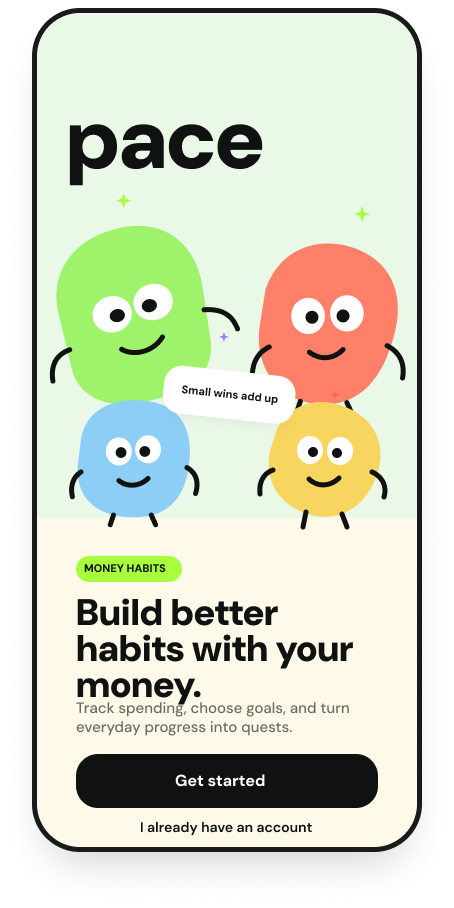
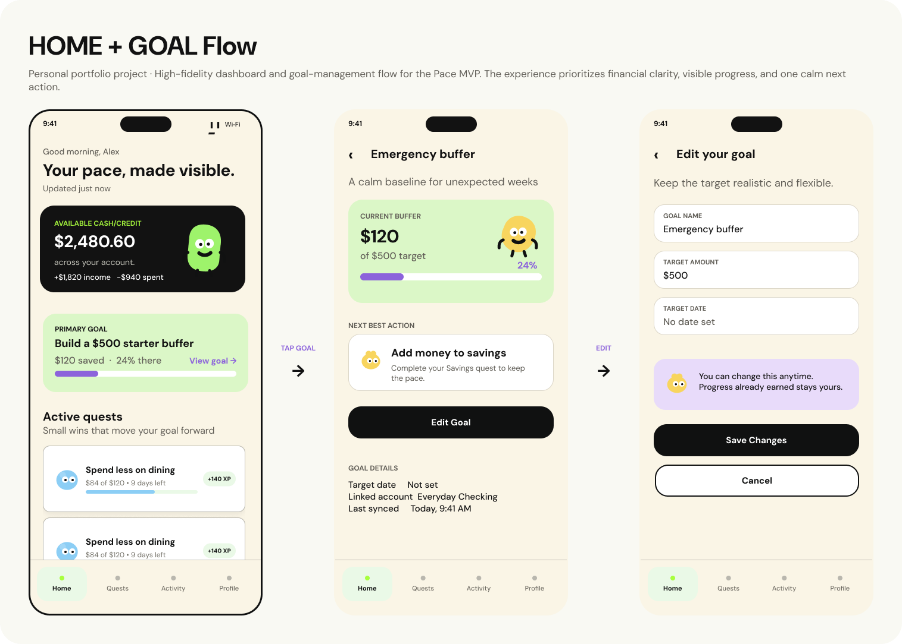
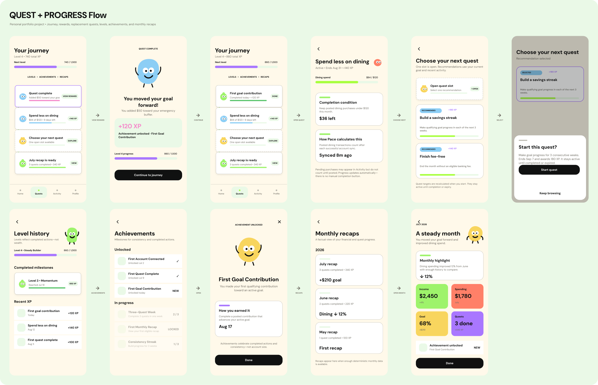

# Pace

Pace is a read-only, money-habit-first iOS app that helps people build better
everyday financial awareness through small, approachable actions. It combines
scoped transaction insights with goals, short-term quests, XP, levels,
achievements, and lightweight monthly recaps.

Pace is intentionally not a full budgeting or banking app. It connects to one
eligible chequing account or credit card through Plaid, uses that account as a
clear data boundary, and never moves money or provides financial advice.

## Intended MVP features

- **Simple onboarding:** Create an account, connect a bank through Plaid, select
  one tracked chequing account or credit card, and import its transactions.
- **Home dashboard:** See a scoped financial snapshot, active quest preview,
  current goal, XP/level context, and synchronization status.
- **Activity:** Browse posted and pending transactions, grouped by date, with
  category and date filters plus user category overrides.
- **Goals:** Choose one focus area—Spend less, Save more, Build awareness, or
  Avoid fees—without pretending to track account-balance targets.
- **Quests:** Select and complete up to three independent, measurable actions
  based on tracked-account activity, such as reviewing purchases,
  categorizing transactions, or noticing fee-like transactions.
- **Progress:** Earn XP once per completed quest, advance through levels, build
  streaks, and unlock explainable achievements.
- **Recaps:** Review monthly tracked spending, category highlights, quest
  results, and XP earned.
- **Profile and privacy:** View connection details, disconnect the bank, review
  data boundaries, sign out, or delete the account.

The product uses supportive, non-shaming language and makes the tracked-account
boundary explicit throughout the experience. It does not support multiple
tracked accounts, money movement, investing, loans, full net-worth tracking,
notifications, or social features in the MVP.

## Design previews

The intended screens and navigation are documented in the [Figma UX flow
specification](docs/FIGMA_UX_FLOWS.md). These previews are exported from the
[Pace UX and UI flows Figma file](https://www.figma.com/design/OQDgUuLO6S5WZ4lcSaLmh0/Pace-%E2%80%94-UX-and-UI-flows).

### Onboarding



### Home and goals



### Quests and progress



## Technology

| Layer | Technology | Responsibility |
| --- | --- | --- |
| Mobile | SwiftUI | Native iOS experience and navigation |
| API | FastAPI / Python | Domain logic, calculations, and writes. Syncs using Plaid webhooks. |
| Auth and database | Supabase Auth + PostgreSQL | Identity, durable product state, and row-level security |
| Financial data | Plaid Transactions | Eligible account metadata and transaction synchronization |
| Design | Figma | Product flows, layouts, components, and visual direction |

## Repository guide

- [Project context](docs/PROJECT_CONTEXT.md) — architecture, vocabulary, and
  locked MVP constraints
- [Product requirements](docs/PRD.md) — scope, journeys, acceptance criteria,
  and non-goals
- [Database schema](docs/DATABASE_SCHEMA.md) — entities, constraints, indexes,
  and RLS requirements
- [API requirements](docs/API_REQUIREMENTS.md) — HTTP contracts, auth, errors,
  and synchronization behavior
- [Figma UX flows](docs/FIGMA_UX_FLOWS.md) — screen-by-screen behavior and
  navigation
- [Documentation index](docs/README.md) — all durable project documentation
- [FastAPI server guide](server/README.md) — setup, run, and verification

## Local development

The backend requires Python 3.13. From the repository root:

```bash
python3 -m venv server/.venv
server/.venv/bin/python -m pip install -r server/requirements.lock
cd server && .venv/bin/uvicorn app.main:app --reload
```

Backend verification:

```bash
cd server
.venv/bin/pytest
.venv/bin/ruff check .
```
